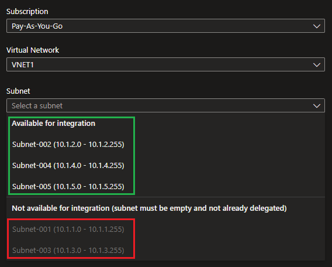
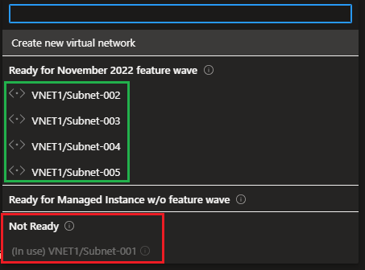

# Azure VNET Delegation

This exercise will demonstrate deployability of resources based on subnet status.

Create the base resources:

```sh
terraform init
terraform apply -auto-approve
```

The following subnets will be created within the VNET:

- Subnet 1 - VM deployed
- Subnet 2 - Empty with with Service Endpoint: `Microsoft.Storage`
- Subnet 3 - Empty with `Microsoft.Sql/managedInstances` subnet delegation
- Subnet 4 - Empty with `Microsoft.Web/serverFarms` subnet delegation
- Subnet 5 - Empty

The results are interesting.

When integrating services to subnets, we get different outputs:

| Service | Subnet 1 | Subnet 2 | Subnet 3 | Subnet 4 | Subnet 5 |
|-|-|-|-|-|-|
| App Service | ❌ | ✅ | ❌ | ✅ | ✅ |
| SQL MAnaged Instance | ❌ | ✅ | ✅ | ✅ | ✅ |

Requirements for **App Service**:



Requirements for SQL Managed Instance:


